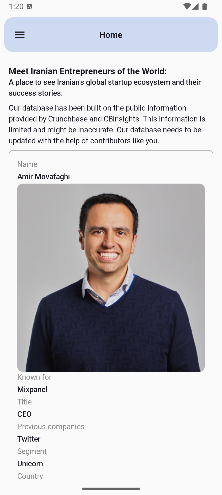
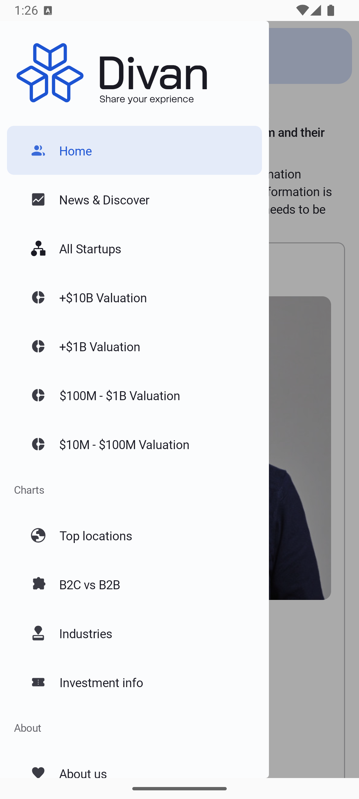
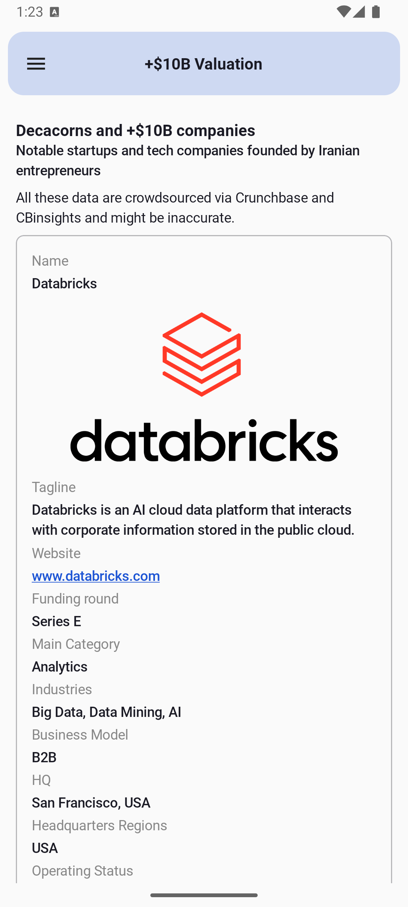
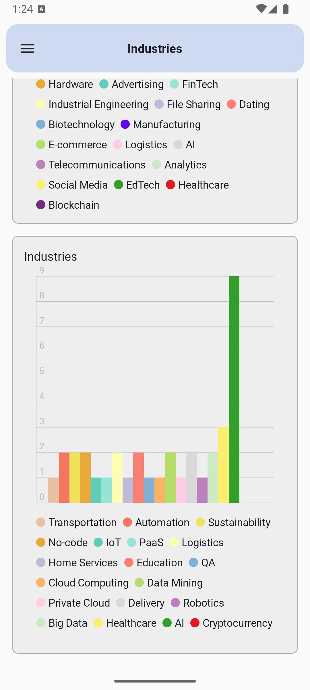
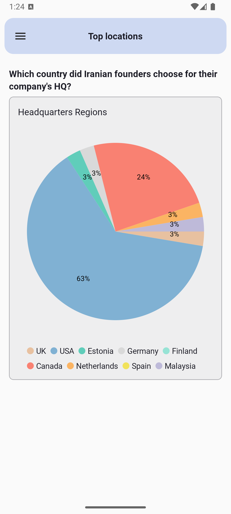
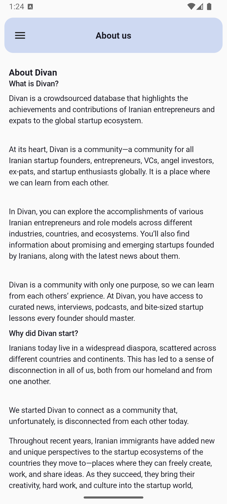
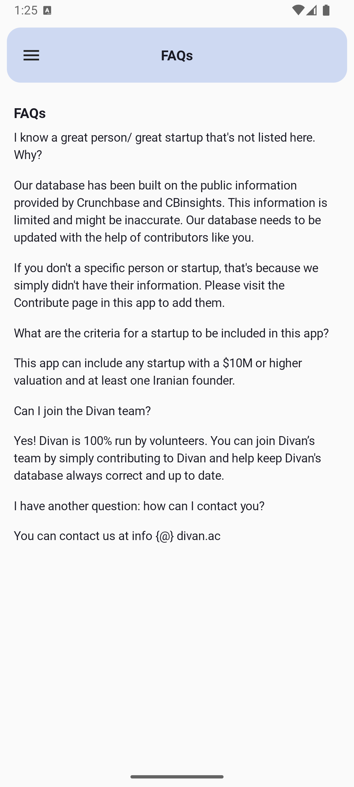
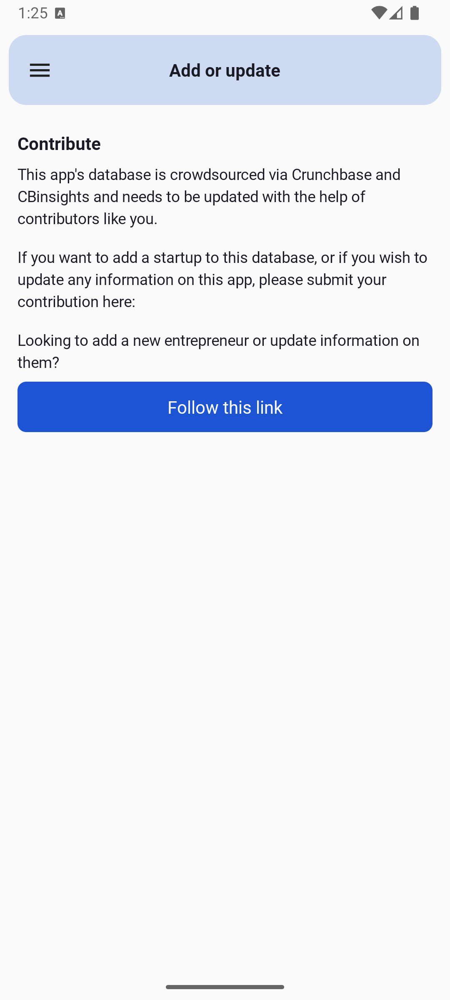

# 📱 Divan Android App  
[Divan: A Hub for Iranian Entrepreneurs](https://divan.ac)  

**Divan Android App, powered by the [Formaloo API](https://docs.formaloo.com/), provides real-time data on Iranian entrepreneurs, startups, news, and industry insights.**  

---

## 🚀 Features  
✅ Fetch dynamic data using APP ID & slugs  
✅ Display structured data based on types  
✅ Fully adaptable for any Formaloo-powered app  
✅ Custom-built charts with zero external dependencies  

---

## 🖥️ Screenshots  

<table>
  <tr>
    <td align="center"></td>
    <td align="center"></td>
    <td align="center"></td>
    <td align="center"></td>
    <td align="center"></td>
  </tr>
  <tr>
    <td align="center"></td>
    <td align="center"></td>
    <td align="center"></td>
    <td align="center"></td>
    <td align="center"></td>
  </tr>
</table>  

---

## 🔧 Installation & Setup  

### 1️⃣ Clone the Repository  
```bash
git clone https://github.com/Milad-Mohammadi/Divan-Android/
cd Divan-Android
```

### 2️⃣ Get Your API Key  
- Log in to [Formaloo Dashboard](https://dash.formaloo.com/profile#api-credentials)  
- Copy your **API Key**  

  

### 3️⃣ Configure API Credentials  
Create an `api.properties` file in the root directory and add:  
```properties
API_KEY={YOUR_API_KEY}
FORM_SLUG={YOUR_APP_SLUG_OR_SHARE_ADDRESS}
```

### 4️⃣ Sync Gradle & Run the Project  
Open the project in **Android Studio**, sync Gradle, and hit **Run**! 🚀  

---

## 👥 Contributing  
We welcome contributions! 🎉 Feel free to:  
- Fork the repository  
- Create feature branches  
- Submit pull requests  

---

## 📜 License  
This project is licensed under the **MIT License**.  

---
